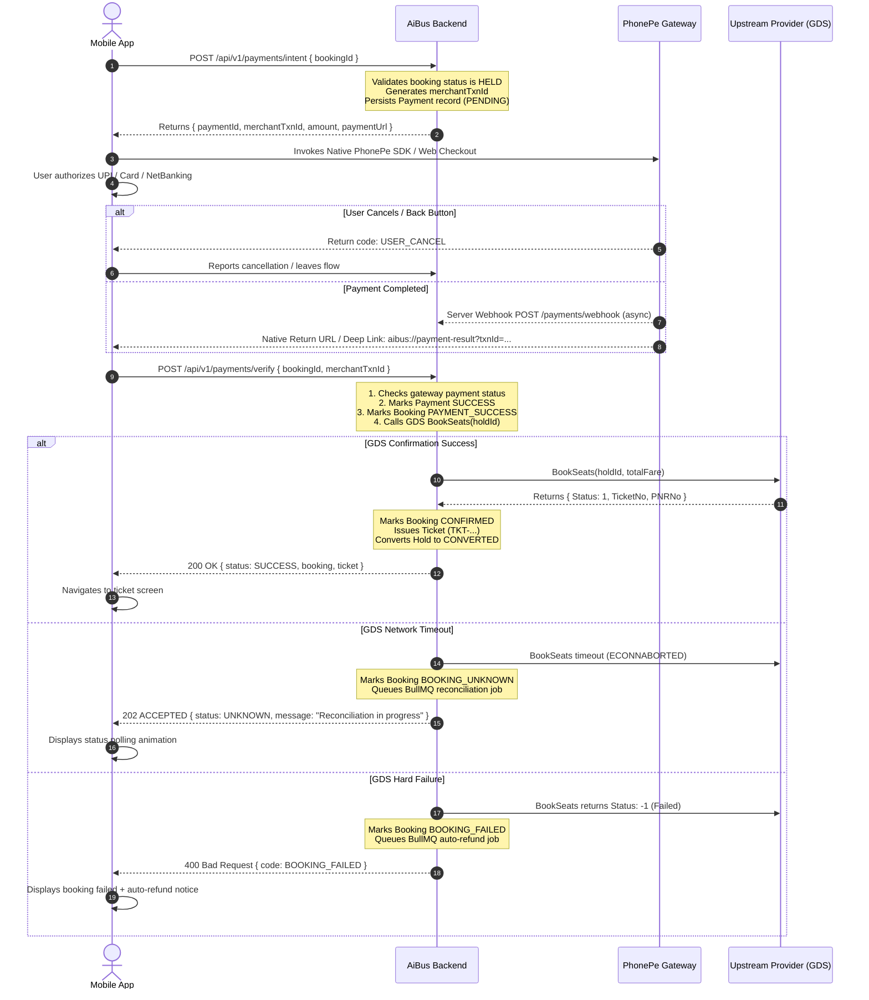

# PAYMENT FLOW & PHONEPE INTEGRATION ARCHITECTURE

This document details the production payment integration architecture for **PhonePe**, treating payment as a distributed transaction across mobile client, payment gateway, backend, and GDS provider.

---

## 1. PhonePe Distributed Transaction Architecture



---

## 2. PhonePe State Machine

The client payment state machine models 18 distinct states:

```typescript
export enum PaymentFlowState {
  IDLE = 'IDLE',
  CREATING_ORDER = 'CREATING_ORDER',
  ORDER_CREATED = 'ORDER_CREATED',
  INITIATING_PAYMENT = 'INITIATING_PAYMENT',
  USER_CANCELLED = 'USER_CANCELLED',
  PROCESSING = 'PROCESSING',
  PENDING = 'PENDING',
  VERIFYING = 'VERIFYING',
  PAYMENT_SUCCESS = 'PAYMENT_SUCCESS',
  PAYMENT_FAILED = 'PAYMENT_FAILED',
  BOOKING_PENDING = 'BOOKING_PENDING',
  BOOKING_SUCCESS = 'BOOKING_SUCCESS',
  BOOKING_FAILED_AFTER_PAYMENT = 'BOOKING_FAILED_AFTER_PAYMENT',
  NETWORK_FAILURE = 'NETWORK_FAILURE',
  PHONEPE_UNAVAILABLE = 'PHONEPE_UNAVAILABLE',
  SESSION_EXPIRED = 'SESSION_EXPIRED',
  HOLD_EXPIRED = 'HOLD_EXPIRED',
  UNKNOWN = 'UNKNOWN',
}
```

---

## 3. Expo Native PhonePe Config Plugin Architecture

To support PhonePe's native Android & iOS SDKs and deep-linking return callbacks in managed Expo builds without ejecting, the application utilizes a custom Expo Config Plugin:

```text
plugins/
└── withPhonePe.ts
```

### 3.1 Plugin Responsibilities:
1. **Android Manifest Injections:**
   * Declares package visibility queries for PhonePe applications (`com.phonepe.app`, `com.phonepe.simulator`).
   * Configures intent filters with scheme `aibus` and host `payment-result`.
   * Adds `tools:replace="android:supportsRtl"` if native AAR collisions occur.
2. **iOS Info.plist Injections:**
   * Registers `LSApplicationQueriesSchemes` including `phonepe`, `ppemerchantsdk`, `paytmmp`, `gpay`, `bhim`.
   * Registers `CFBundleURLTypes` with URL scheme `aibus`.
3. **Build Fallback (Development & Production):**
   * Automatically provides high-fidelity in-app simulated PhonePe payment flow in Expo Go & development environments when native PhonePe AAR is not compiled into the current binary.
   * Directly interfaces with PhonePe Production SDK in EAS standalone release builds.

---

## 4. Payment Failure & Crash Recovery

### 4.1 Process Death During Payment
1. **State Preservation:**
   * Prior to launching PhonePe, the mobile app writes transaction metadata to encrypted local storage (`expo-secure-store`):
     ```json
     {
       "bookingId": "uuid",
       "merchantTxnId": "TXN-...",
       "amount": 950,
       "timestamp": 1718000000000
     }
     ```
2. **Resumption on Cold Start:**
   * In `useAppBootstrap`, detect the pending payment record.
   * If record age is < 15 minutes, query backend:
     `POST /api/v1/payments/verify` with `{ bookingId, merchantTxnId }`.
   * If backend verifies payment succeeded:
     * Clear pending payment record.
     * Navigate directly to `ticket/[bookingId].tsx`.
   * If backend indicates payment failed or was never completed:
     * Clear pending transaction.
     * Display a gentle toast: *"Previous transaction was not completed."*

### 4.2 Delayed Webhook Reconciliation
If the user returns to the app before the PhonePe webhook reaches the backend:
* The mobile client calls `POST /api/v1/payments/verify`.
* If the backend returns `PAYMENT_PENDING` (status 202), the mobile client starts exponential backoff polling (intervals: 2s, 3s, 5s, 8s up to 30 seconds max).
* If still pending after 30 seconds, display the **Transaction Pending** screen explaining:
  *"Your payment is currently being confirmed with your bank. You will receive an SMS and ticket confirmation shortly."*
