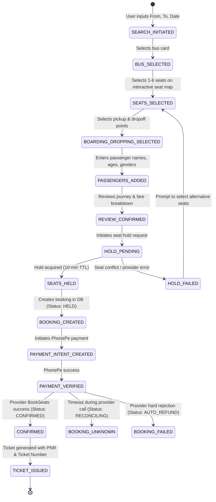

# BOOKING FLOW & STATE MACHINE ARCHITECTURE

This document formalizes the complete customer bus-booking lifecycle, states, invariants, transitions, and recovery mechanisms implemented across the mobile client and backend.

---

## 1. High-Level Booking Lifecycle

---

## 2. Formal Booking State Machine

| State | Source of Truth | Permitted Transitions | Client UI Behavior |
| :--- | :--- | :--- | :--- |
| `IDLE` | Client | `SEARCHING` | Clean home screen |
| `SEARCHING` | Client / Cache | `BUS_LIST_VIEW` | Search query loading skeleton |
| `SEAT_SELECTION` | Client / Server | `POINTS_SELECTION` | Interactive deck layout, price ticker |
| `HOLD_REQUESTED` | Server (`holdsService`) | `HELD`, `HOLD_FAILED` | Loading spinner over Review button |
| `HELD` | Server (`seatHold` table) | `BOOKING_CREATED`, `EXPIRED` | 10-minute persistent countdown timer |
| `PAYMENT_PENDING` | Server (`booking` table) | `PAYMENT_SUCCESS`, `PAYMENT_FAILED` | Payment gateway / PhonePe SDK active |
| `PAYMENT_SUCCESS` | Server (`paymentsService`) | `CONFIRMED`, `BOOKING_UNKNOWN`, `FAILED` | Transaction processing animation |
| `CONFIRMED` | Server (`booking.status`) | `CANCELLED` | Success screen + view ticket button |
| `BOOKING_UNKNOWN` | Server (timeout state) | `CONFIRMED`, `REFUNDED` | Status polling modal ("Confirming with operator...") |
| `BOOKING_FAILED` | Server | `REFUNDED` | Actionable failure card with refund notice |
| `CANCELLED` | Server (`cancellation` table) | None | Cancelled ticket badge, refund receipt |

---

## 3. Seat Hold & Real-Time Availability Lifecycle

### 3.1 Two-Tier Concurrency Control
1. **Tier 1 (Redis Distributed Locks):**
   * Key pattern: `aibus:lock:seat:gds:{busId}:{journeyDate}:{seatNo}`
   * TTL: 30 seconds (`SEAT_LOCK_TTL_SECONDS`).
   * Prevents two concurrent users from submitting the same seat to the upstream provider simultaneously.
2. **Tier 2 (Upstream Provider GDS Hold & DB Hold Record):**
   * Upstream GDS `HoldSeats` allocates the seats and returns `providerHoldId`.
   * DB records `SeatHold` row with `expiresAt = now + 10 minutes`.
   * BullMQ queue schedules delayed expiry job at `t = 10 minutes`.

### 3.2 Client Seat Hold Timer & Recovery
* When `holdsService.holdSeats()` succeeds:
  1. Store `{ holdId, providerHoldId, expiresAt, totalFare }` in `useBookingStore`.
  2. Start an active countdown timer at the top of subsequent screens (Boarding, Passengers, Review, Payment).
  3. If `expiresAt` is reached before payment initiation:
     * Display modal: *"Your seat hold has expired (10-minute limit). Please review seat availability to proceed."*
     * Invalidate `['seats', 'chart', busId]` query.
     * Navigate user safely back to `booking/seat-map.tsx`.

---

## 4. Cold-Start Booking Recovery

If the user closes the app, kills the process, or the OS kills the process during payment or review:

1. **On App Mount (`_layout.tsx` / `useAppBootstrap`):**
   * Inspect persistent local booking transaction key in storage.
   * If a pending transaction exists with `bookingId`:
     * Call `GET /api/v1/bookings/:id`.
     * If `status === 'CONFIRMED'`: navigate straight to `ticket/:id`.
     * If `status === 'PAYMENT_PENDING'`: check PhonePe payment status via `POST /api/v1/payments/verify`.
     * If `status === 'HELD'` and `hold.expiresAt > now`: restore booking flow at payment screen.
     * If hold is expired: clear pending transaction, notify user gently with a non-intrusive toast.

---

## 5. Conflict Resolution UX

1. **Seat Becomes Unavailable While Viewing Map:**
   * Handled gracefully via `SEAT_NOT_AVAILABLE` domain error.
   * Highlight affected seats in amber/red with message: *"Seat L1 was just reserved by another passenger. Please select another seat."*
   * Automatically re-query seat chart.
2. **Price Changed Between Search & Hold:**
   * Server computes authoritative `totalFare` on hold and returns it.
   * Client compares returned fare with search fare. If changed, display price update banner before user proceeds to payment.
